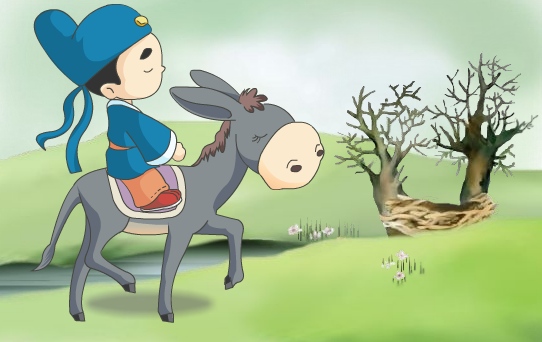
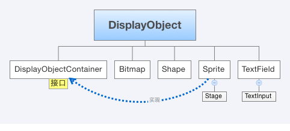

“显示对象”，准确的含义是可以在舞台上显示的对象。可以显示的对象，既包括可以直接看见的图形、文字、视频、图片等，也包括不能看见但真实存在的显示对象容器。

在Egret中，视觉图形都是由显示对象和显示对象容器组成的。

如果我们要表达上图中的场景，我们应该如何通过树的方式来描述呢？

## (一)、显示对象等级结构

在这个树状结构中，处于最上层的，就是“舞台”。对应到程序中，我们可以看到一个 stage 对象。舞台是Egret显示架构中最根本的显示容器。每个Egret应用有且只有一个stage对象。舞台是这个显示树结构的根节点。

在Egret中，显示对象被分为两大类：一种是可以包括其他显示对象的显示对象容器，简称为“容器”。另外一种是单纯的显示对象，除自身以外不能包括其他显示对象，简称“非容器对象”。

在实际的操作中，我们可以把这样一种结构看成一个树状结构，容器可理解为树枝，非容器对象则可以理解为树叶。

在这个树状结构中，处于最上层的，就是“舞台”。对应到程序中，我们可以看到一个 stage 对象。舞台是Egret显示架构中最根本的显示容器。每个Egret应用有且只有一个stage对象。舞台是这个显示树结构的根节点。

在舞台中，我们还拥有一个主容器。这个容器就是文档类所创建的容器。每一个Egret都会拥有一个文档类，这个文档类必须是一个显示对象容器.

在这个场景中，我们包含了一个场景背景，而背景是由背景图和一颗大树组成的。另外两个元素是由人物和一个草地组成的。

### 显示列表

上面我们所看到的树状显示对象结构图实际上就是Egret的“显示列表”。

使用显示列表管理容器和非容器对象是非常方便的，当某一个显示对象处在在显示列表中，我们就可以在画面中看到该对象。当我们将显示对象从显示列表中移除后，该对象则从画面中消失。

在Egret内部维护着一个显示列表，开发者无需关心该列表是如何运行的，你只需要对自己的显示对象进行相应的操作即可。

## (二)、核心显示类

Egret 中一共封装了7个显示相关的核心类，一个接口，具体继承结构如下：

| 类 |  描述 |
|  --- |  --- |
|  DisplayObject | 显示对象基类，所有显示对象均继承自此类 |
|  Bitmap |  位图，用来显示图片 |
|  Shape | 用来显示矢量图，可以使用其中的方法绘制矢量图形 |
|  TextField |  文本类 |
|  DisplayObjectContainer |  显示对象容器接口，所有显示对象容器均实现此接口 |
|  Sprite |  带有矢量绘制功能的显示容器 |
|  Stage |  舞台类 |

