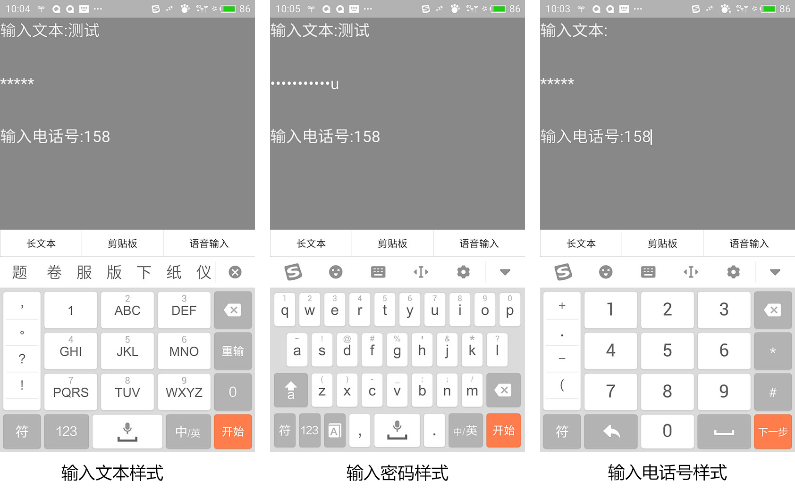

在现代游戏或应用开发中，输入文本都是不可或缺的功能。

在Egret中，我们可以很方便的将文本框设置为可输入，如下代码所示：

```
var txInput:egret.TextField = new egret.TextField;
txInput.type = egret.TextFieldType.INPUT;
txInput.width = 282;
txInput.height = 43;
txInput.x = 134;
txInput.y = 592;
txInput.textColor = 0x000000;
/// 注意_container是事先建立好的一个显示容器，即 egret.Sprite，并且已经添加到显示列表中
this._container.addChild(txInput);
```

关键代码是设置其类型为 INPUT。

但是目前，文本框的背景还没有完美的实现，如果需要设置背景，可以用这么一个专用函数来搞定：

```
private layTxBg(tx:egret.TextField):void {
    var shp:egret.Shape = new egret.Shape;
    shp.graphics.beginFill(0xffffff);
    shp.graphics.drawRect(tx.x, tx.y, tx.width, tx.height);
    shp.graphics.endFill();
    this._container.addChild(shp);
}
```

这个函数以现有的文本框为基础，绘制一个与其同位置同大小的矩形背景。并添加到显示列表中。

使用时需要注意：添加背景的代码需要放在添加文本的代码之前，以使背景处于文本之下：

```
this.layTxBg(txInput);
this._container.addChild(txInput);
```

通常我们设置白色背景，如图所示：


### 获得焦点

通过输入文本的 setFocus 方法，可以在用户操作下使输入文本获得焦点。需要注意的是 setFocus 方法需要在用户操作的事件中进行调用，比如下面这样：

```
var textIput:egret.TextField = new egret.TextField();
textIput.type = egret.TextFieldType.INPUT;
this.addChild(textIput);

var button:egret.Shape =  new egret.Shape();
button.graphics.beginFill(0x00cc00);
button.graphics.drawRect(0,0,100,40);
button.graphics.endFill();
button.y = 50;
this.addChild(button);
button.touchEnabled = true;
button.addEventListener(egret.TouchEvent.TOUCH_BEGIN,(e) => {
        textIput.setFocus();
    }, this);
```

这里我们首先创建了一个输入文本和一个按钮，在按钮的触摸事件回调函数中调用输入文本的 setFocus 方法。不通过用户的操作触发直接调用 setFocus 会导致输入文本有问题，应避免这种使用方式。

### 设置输入样式

在 Egret 3.1.2 中更新了设置输入文本样式，现在支持 3 中输入样式即普通文本（默认），密码和电话号。设置不同的类型输入的样式和手机上弹出面板是不同的。设置密码样式输入时显示密码，设置电话号样式输入时在手机上弹出数字输入面板。

设置输入文本样式首先要设置 TextField 的 TextFieldType 为 INPUT 类型。然后设置 TextField 的 inputType 即可。

```
var text:egret.TextField = new egret.TextField();
text.type = egret.TextFieldType.INPUT;
//设置输入文本的样式为文本
text.inputType = egret.TextFieldInputType.TEXT;
text.text = "输入文本:";
text.width = 300;
this.addChild(text);

var pass:egret.TextField = new egret.TextField();
pass.type = egret.TextFieldType.INPUT;
//设置输入文本显示为密码
pass.inputType = egret.TextFieldInputType.PASSWORD;
//设置密码显示
pass.displayAsPassword = true;
pass.text = "输入密码:";
pass.y = 100;
pass.width = 300;
this.addChild(pass);

var tel:egret.TextField = new egret.TextField();
tel.type = egret.TextFieldType.INPUT;
//设置输入电话号样式
tel.inputType = egret.TextFieldInputType.TEL;
tel.text = "输入电话号:"
tel.y = 200;
tel.width = 300;
this.addChild(tel);
```



最终效果如上图所示，可以看到在输入文本样式下弹出默认输入法，在密码样式下弹出英文输入法，在输入电话号样式下弹出数字输入。


