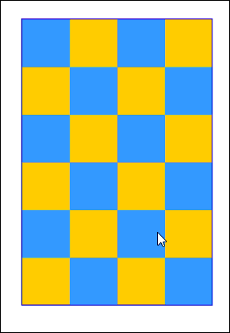
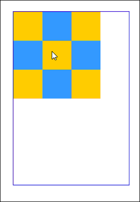

ScrollView 即为滚动视图，开启一个滚动窗口，可以在里面添加显示内容，内容可以在此固定大小的窗口内左右上下滑动。ScrollView 和其他显示对象一样，需要添加到显示列表中才能被显示出来。下面介绍如何使用 ScrollView 并演示其效果。

> 在Egret 2.5 以上的版本中需要注意的是 `egret.ScrollView` 类位于`game`库当中，如果使用的话需要确保项目中引用了`game`库。方法操作可以参考：[模块化配置和第三方库的使用方法](../../../extension/threes/instructions/README.md)

### 创建滚动视图

创建一个 `ScrollView` 实例很简单，与其他类一样:
```
var myscrollView:egret.ScrollView = new egret.ScrollView();
```
这里我们创建了一个空的`myscrollView`，给这个`ScrollView`添加一个滚动显示的"内容"可以这样:
```
myscrollView.setContent(内容显示对象);
```
如果不设置滚动视图的宽和高，`myscrollView`的宽和高将被内容撑大，看不到滚动的效果。所以一般需要我们设置滚动视图的宽和高：
```
myscrollView.width = 宽;
myscrollView.height = 高;
```
最后一步就是把`myscrollView`添加到显示对象添加到显示列表当中：
```
容器.addChild(myscrollView);
```
当然`myscrollView`里面的"内容"是不需要添加到显示列表中的，放到`ScorllView`里面即可。

### ScrollView 的其他设置

首先来完善上面的程序，如下:
```
class ScrollViewDemo extends egret.DisplayObjectContainer {

    public constructor () {

        super();
        this.once(egret.Event.ADDED_TO_STAGE,this.onAddToStage,this);

    }
    private  onAddToStage () {
        //创建内容，边长为50 * 50 的格子 9 * 9个。
        var content:egret.Shape = this.createGird(50,50,9,9);
        //创建ScrollView
        var myscrollView:egret.ScrollView = new egret.ScrollView();
        myscrollView.setContent(content);
        myscrollView.width = 200;
        myscrollView.height = 300;
        myscrollView.x = this.stage.stageWidth / 2;
        myscrollView.y = this.stage.stageHeight / 2;
        myscrollView.anchorOffsetX = myscrollView.width / 2;
        myscrollView.anchorOffsetY = myscrollView.height / 2;
        this.addChild(myscrollView);
        //背景图，用来展现ScrollView 的边界
        var background:egret.Shape = new egret.Shape();
        background.graphics.lineStyle(1,0x1102cc)
        background.graphics.drawRect(0,0,200,300);
        background.graphics.endFill();
        background.x = this.stage.stageWidth / 2;
        background.y = this.stage.stageHeight / 2;
        background.anchorOffsetX = background.width / 2;
        background.anchorOffsetY = background.height / 2;
        this.addChild(background);
    }
    //创建格子函数，根据输入的宽和高来创建一个 row * line的格子图。并返回Shape对象。
    private createGird(w:number,h:number,row:number,line:number):egret.Shape {

        var shape:egret.Shape = new egret.Shape();
        for(var i = 0;i < row;i++ ) {
            for(var j = 0; j < line;j++) {
                if ((j + row * i) % 2 === 0) {
                    shape.graphics.beginFill(0xF9C20B);
                    shape.graphics.drawRect(j * w, i * h, w, h);
                    shape.graphics.endFill();
                }
                else {
                    shape.graphics.beginFill(0x2A9FFF);
                    shape.graphics.drawRect(j * w, i * h, w, h);
                    shape.graphics.endFill();
               }
            }
        }
        return shape;
    }

}
```

上面首先创建一个由 50 * 50 的格子组成的 9 * 9的图形模拟ScrollView的内容。然后我们创建了一个ScrollVeiw，并把他放到屏幕中间设置他的宽和高为 200 * 300，这样内容的区域比ScollView的区域要大，可以看到滚动的效果。最后汇总了一个跟ScrollView同样大小的边框，来显示ScollView的边界。现在我们能看到下面的效果：


#### 启用回弹

`ScrollView`的`bounces`是否启用回弹，当启用回弹后，ScrollView中内容在到达边界后允许继续拖动，在用户拖动操作结束后，再反弹回边界位置。
默认情况下是启用回弹的，下面关闭回弹来看看效果。
在上面代码中`this.addChild(myscrollView);`这一行后面加入
```
myscrollView.bounces = false;
```


#### 滚动策略

ScrollView 有可以设置两种滚动策略，水平滚动策略(horizontalScrollPolicy)和垂直滚动策略(verticalScrollPolicy)。都有三个具体的值，`on`,`off`和`auto`，默认为`auto`。
以水平滚动策略为例，如果设置为`on`,表示ScrollView里面的"内容"可以水平拖动，相反如果设置为`off`将不能拖动。设置为`auto`时有所不同，只有当"内容"大于ScrollView的宽度时才可以拖动。具体可以看下面的代码，我们先把格子缩小，修改其宽度，然后设置ScrollView的水平滚动策略为`auto`,垂直滚动策略为`on`,来看看效果。
修改`content`的代码如下，格子为 3*3： 
```
//创建内容，边长为50 * 50 的格子 3 * 3个。
var content:egret.Shape = this.createGird(50,50,3,3);
```
在上面代码中`this.addChild(myscrollView);`这一行后面加入
```
//垂直滚动设置为 on 
myscrollView.verticalScrollPolicy = "on";
//水平滚动设置为 auto
myscrollView.horizontalScrollPolicy = "auto";
```


可以看到只能在垂直方向滚动，而水平方向不能滚动。当然默认的滚动策略为`auto`,我们可以按需要更改。

#### 监听事件

当拖动 ScrollView 里面的内容时会抛出 `egret.Event.CHANGE` 事件。完成一次拖动在下一次开始之前会抛出`egret.Event.COMPLETE`,继续添加下面代码：
```
myscrollView.addEventListener(egret.Event.COMPLETE,this.onComplete,this);
myscrollView.addEventListener(egret.Event.CHANGE,this.onChange,this);
```
并在`ScrollViewDemo`类里添加监听处理函数：
```
private onComplete(event:egret.Event) {
    console.log("on Complete")
}
private onChange(event:egret.Event){
    console.log("on Change");
}
```
可以看到下面效果：


其他效果可以参考API：[ScrollView](http://edn.egret.com/cn/index.php/apidoc/egret243/name/egret.ScrollView)